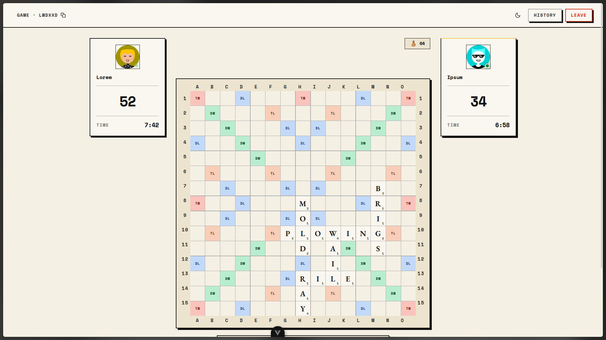

# LEXI



_It probably should have existed already._

---

It starts the way most good engineering ideas do:  
**I just wanted to play Scrabble with a friend.**

Nothing grand. No startup thesis, no market gap analysis. Just two people, one board, a browser tab, and the simple expectation that in 2026 this should be frictionless.

It wasn't.

Every option I tried fell into the same three buckets:

1. **Technically works, looks like a museum exhibit.** The game logic was fine, but the UI was frozen in 2008. Small fonts, cramped grids, no love for the screen.
2. **Modern UI, terrible game.** Smooth animations, flashy gradients, a board you could barely read because it was optimized for a slot machine, not a word game.
3. **Overdesigned.** Features on top of features — accounts, rankings, chat, avatars you had to unlock, ads between every turn.

Nothing just let you **load a page and play Scrabble**.

---

I sat on the frustration for a while. And then my brain did what it always does best — it started reframing:

> This isn't about Scrabble apps.  
> It's about the absence of a fast, intentional, respectful implementation of a simple turn-based game.

Scrabble as a system is elegant. The rules are deterministic. The board is a 15×15 grid. The scoring is arithmetic. There's no ambiguity. The digital experience around it should match that clarity — but it doesn't. The game has been dragged through layers of monetisation, platform trends, and neglect.

That's a quiet software gap. The kind that shouldn't exist anymore, but still does because nobody cared enough to fix it properly.

So the idea stopped being *"let me find a better app"*  
and turned into:

> Fine. I'll just build the version that should exist.

---

I decided to build **two things**:

1. A **pure game engine** — zero-dependency Python that validates moves, scores words, and manages the bag. No framework, no I/O. Just logic.
2. A **FastAPI server** that wraps the engine, pushes state over SSE, and stores games in Redis. The frontend? It doesn't compute — it just renders.

Why split it? Because the engine is the source of truth. All moves are validated server-side. There's no "challenge" mechanic — the DAWG decides. If the word isn't in the dictionary, the move doesn't go through. It's simpler, faster, and there's zero room for argument.

The backend is a modular monolith:  
`routes → services → repositories → engine`

One lock per game. One SSE stream per player. Full `GameState` pushed on every event — the frontend never mutates.

---

The frontend is Vue 3 with a single rule: **it is dumb**. It never computes a score, never validates a word, never guesses whose turn it is. It receives a full `GameState` from the SSE stream, drops it into a Pinia store, and renders what it sees.

Three screens, all driven by server state:
- **Lobby** — pick an avatar, enter a nickname (10 chars max, trimmed), create or join by 6-character code
- **Game** — board, rack, controls, two player panels with live clocks and connection dots
- **Overlay** — game over (win/forfeit/timeout) or game paused (disconnect)

The design system is: Neo-brutalist. Hard offset shadows, no blur. 2px borders throughout. Space Mono for UI, EB Garamond for display. Two modes — light (cream paper + ink) and dark (near-black + chalk). Toggle whenever.

---

**Why SSE instead of WebSockets?**  
`EventSource` is native to every browser. No reconnection libraries, no handshake ceremony, no frame parsing. You open a URL, you get a stream of JSON. For a game where the server pushes state maybe once every 30 seconds, it's perfect.

**Why Redis?**  
Survives restarts. If the container goes down mid-game, the state is still there when it comes back. Not strictly necessary at launch scale, but I'd rather have it and not need it than the reverse.

**Why a monorepo with a workspace?**  
The engine is a separate Python package (`game-engine`) with no dependencies. It can be tested in isolation, reused, or even published separately. The backend imports it like any other library. Clean boundary.

---

The architecture, visually:

```
                        ┌──────────────────────────────────┐
                        │          Browser (SPA)            │
                        │    Vue 3 · Pinia · Tailwind      │
                        │    EventSource ◄── SSE           │
                        │    POST ──► HTTP                 │
                        └───────────┬──────────────────────┘
                                    │
            ┌───────────────────────┼───────────────────────┐
            │        FastAPI (Docker)                       │
            │           routes/ → services/ → repos/        │
            │               ┌──────────────┐                │
            │               │ game-engine  │                │
            │               │ (pure logic) │                │
            │               └──────────────┘                │
            │        SSE Manager (in-process)               │
            └───────────────────────┼───────────────────────┘
                                    │
                        ┌──────────┴──────────┐
                        │      Redis           │
                        │  game:{code}         │
                        │  session:{token}     │
                        └─────────────────────┘
```


---

I don't know how big this will get. Maybe it stays a personal project I play with friends. Maybe it finds a corner of the internet that's been waiting for a clean Scrabble implementation. Either way, it exists now.

**Lexi.** Light. Fast. Brutalist. No ads. No accounts. No noise.

---

### Tech Stack

| Layer | Choice | Why |
|-------|--------|-----|
| Engine | Python 3.12+ (pure) | Zero-dependency, testable domain logic |
| Backend | FastAPI | Native async, SSE support, automatic OpenAPI |
| State | Redis | Survives container restarts |
| Frontend | Vue 3 + TypeScript | Reactive by design, perfect for full-state pushes |
| Styling | TailwindCSS v4 + Lexi CSS | Design tokens in CSS vars, utility classes at compile time |
| Build | Vite 6 | Instant HMR, Rust-powered bundling |
| Monorepo | uv workspaces | Single `uv sync`, clean boundaries |
| Deploy | Docker + VPS | Single container, trivial rollback |

### Deployment

This repo includes separate Railpack configs at the project root:

- `railpack.frontend.json` for the Vue/Vite SPA
- `railpack.backend.json` for the FastAPI API server

#### Frontend

From the repo root:

```bash
railpack build --config-file ./railpack.frontend.json --name lexi-frontend .
```

The app expects the API base URL to be provided at runtime through the Vite env var:

```bash
VITE_API_BASE=https://your-api-domain
```

If you are serving the app behind a reverse proxy or a static host, make sure the frontend is configured to talk to the backend URL you expose for the FastAPI service.

#### Backend

From the repo root:

```bash
railpack build --config-file ./railpack.backend.json --name lexi-backend .
```

The backend reads runtime environment variables such as:

```bash
REDIS_URL=redis://your-redis-host:6379
FRONTEND_URL=https://your-frontend-domain
CORS_ORIGINS=https://your-frontend-domain
```

The app starts with Uvicorn and serves the FastAPI app from `backend_api.main:app`.

#### Local development

```bash
make backend
make frontend
```

This runs the API on port 8000 and the frontend on the Vite dev server, typically port 5173.

### Project Layout

```
lexi/
├── packages/
│   ├── game-engine/        # Pure domain logic
│   │   └── src/game_engine/
│   │       ├── turn.py     # Turn.apply — the one seam for place/swap/pass + clock/end-of-game rules
│   │       ├── board.py    # Grid, adjacency, placement rules
│   │       ├── scoring.py  # Score calculation + premiums
│   │       ├── bag.py      # Tile draw and exchange
│   │       ├── models.py   # GameState, Tile, Move
│   │       └── dictionary.py  # Pickled frozenset lookup
│   └── backend-api/        # FastAPI server
│       └── src/backend_api/
│           ├── routes/               # HTTP endpoints + SSE
│           ├── services/             # Game lifecycle orchestration
│           ├── repositories/         # Redis persistence
│           ├── connection_lifecycle.py  # SSE connect/disconnect, pause/resume/forfeit state machine
│           ├── game_broadcaster.py      # Serializes GameState per viewer, pumps SSE payloads
│           ├── turn_clock.py            # Per-game elapsed-time measurement + overtime rules
│           └── game_manager.py          # Per-game locks + turn timers
├── frontend/               # Vue 3 SPA
│   └── src/
│       ├── views/          # LobbyView, GameView
│       ├── components/     # Board, Rack, Panels, Sidebar
│       ├── stores/         # Pinia — single source of truth
│       ├── composables/    # sse, useClocks, usePendingMove, useTheme
│       └── lexi.css        # All design tokens
└── docs/
    ├── ARCHITECTURE.md     # Full system decisions (Q1–Q31)
    ├── FRONTEND.md         # Frontend decisions (FQ1–FQ13)
    └── UI_DESIGN_BRIEF.md  # Complete design reference
```
